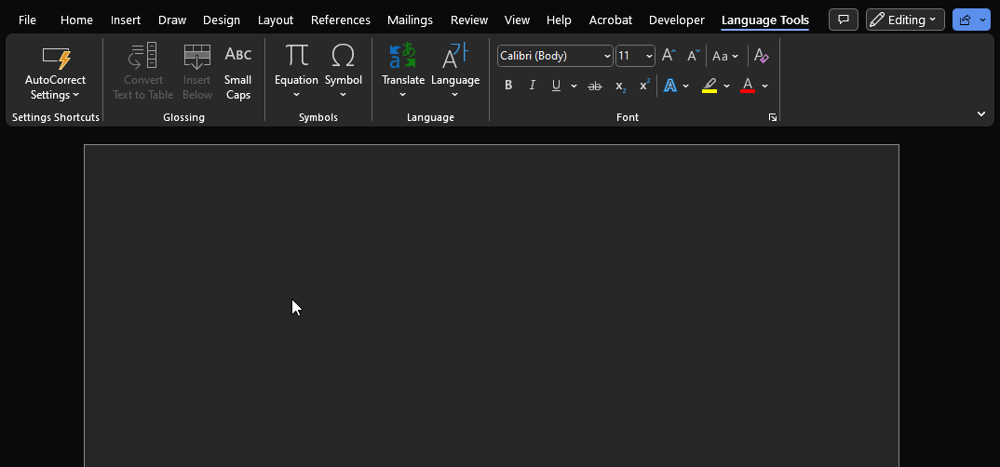
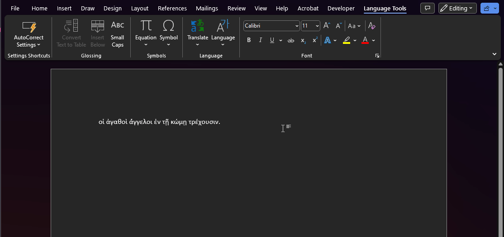
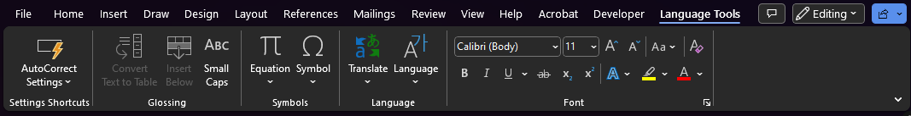
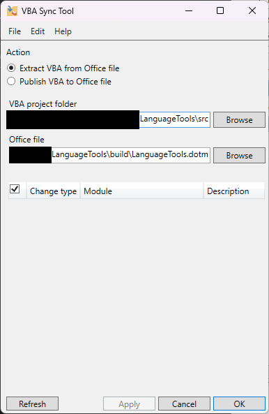

# Language Tools
A Ribbon Tab for MS Word, providing quick access to Language-related tools and settings I find vaguely useful for notes associated with language learning (as opposed to "normal" word-processing), including quickly disabling unhelpful AutoCorrect and Proofing settings, and quick access to the table-wrangling tools I use for glossing.

See the Security section of this doc for some cautionary notes. Ideally, if Office-JS ever improves (see the [Why a VBA Add-in?](#why-a-vba-add-in) section), ideally this will be converted that style of add-in.

This is largely for personal use, but if anyone else finds it useful, or would find it more useful with the addition of anything else, do let me know. Much of what I've written here is for my own reference, when I inevitably forget everything, and then need to perform maintenance or extend this a year later.

⌘ Note for Mac Users: this should work for you, in theory! I no longer have a Mac for testing, so do let me know if you do use this, and run into any issues.

- [Language Tools](#language-tools)
  - [Features](#features)
  - [Installation](#installation)
  - [Security](#security)
  - [Background](#background)
  - [Further Development](#further-development)
    - [Reference Links](#reference-links)
    - [Tools](#tools)
  - [Why a VBA Add-in?](#why-a-vba-add-in)

## Features
- Custom menu for rapidly disabling (or enabling, or viewing the state of) AutoCorrect and Proofing options that can mess with diacritics etc, and disable Spelling and Grammar checking which can obscure diacritics (or some combination of these toggles).
  - 

- Quick access to built-in tools for table-based glossing (note that I'm not a linguist, so this may not support more serious work than what I've cobbled together to help me learn!)
  - 

- Quick access to various other settings
  - 

## Installation

- File > Options > Add-Ins > Manage [Drop-down] > [Select from list] Word Add-Ins > [Press] Go

- In the "Global Templates and Add-Ins" section, press the "Add" button, choose the "LanguageTools.dotm" file.

- You will likely receive a "Microsoft Word Security Notice", identifying the add-in as a security concern due to having Macros.
  - The message is right! Macro add-ins are a security concern! You shouldn't even open macro-enabled files you're sent in most circumstances, let alone enable macros for them.
  - See the [Security](#security) section below for more info.
  - If you're sure it's safe, then select "Enable Macros"

## Security

This is a macro-enabled template, intended to be installed as a global Word Add-In. All of these things are security red-flags.

This is a public repo with an explicitly open license (the "unlicense"), containing everything you need to reconstruct or modify this Add-In yourself, but equally, someone could fork this, modify their version to do something malicious, and send it to you.

If you wish to reconstruct this yourself from scratch, rather than trusting this repository
- To obtain the ribbon tab definition: the `build/LanguageTools.dotm` add-in can be opened in a plain-text editor. Find the `<customUI>` XML. You can use this to modify your own `.dotm` file using the Office RibbonX Editor, to include this custom Ribbon tab definition
- The VBA code is listed in the `src/` directory. The key file is `AutoCorrectInterfaceHandlers.base`; `RibbonLoad.bas` only stores a reference to the ribbon for invalidation, in case it's needed in future. You can retain this, or discard it (just make sure you remove the `onLoad` attribute in the XML discussed above). You can add this to your template using the Word VBA Editor or teh VBA Sync tool, after verifying it to your satisfaction.

You should make your own assessment of any risks involved - as noted above, this is a personal project. Feel free to get in touch though if you want to discuss it!

I'm unlikely to ever code-sign this, unless it's significantly extended to do more things, and it needs to be used in a controlled environment where e.g. GroupPolicy settings require something signed by a Trusted Publisher.

## Background
While studying (beginner!) Ancient Greek and Latin, I've found three major points of annoyance (so far!):
- Word quietly "correcting" things - various pieces of polytonic Greek being changed to modern equivalents or treated as misspellings, losing macrons off Latin words that have an English homograph or similar, etc.
- Grammar and Spelling underline suggestion "squiggles" obscuring diacritics (and generally being unhelpful!)
- Lots of fiddly clicking when glossing: take a sentence, convert it to a table, add a row below, etc.

## Further Development
Development of VBA Add-Ins is a bit of a clunky workflow, which I won't go into detail on unless someone asks (please do feel free to ask though). Some starting points on reference material and tools below however.

### Reference Links
The documentation for VBA Add-in dev is pretty rough, and often outdated, and community knowledge in forums etc tends to be directed towards Excel. Still, some useful resources:
- [MS Documentation for Ribbon Elements](https://learn.microsoft.com/en-us/openspecs/office_standards/ms-customui/d842006e-3187-4f66-a17d-0819a3cc94b5)
  - Usually has pictures. Not always user-friendly
- [BetterSolutions Ribbon Doc](https://bettersolutions.com/vba/ribbon)
  - Alternative doc site for ribbon info, sometimes a bit less painful than MS doc site. No images, sometimes a bit less detailed, but also sometimes written in a more comprehensible way!
- [Event Handling guide](https://learn.microsoft.com/en-us/office/vba/word/concepts/objects-properties-methods/using-events-with-the-application-object-word)
  - Not presently in use, but might be in future (e.g. for detecting and reacting to the user switching to a different document)
- [An Excel example of setting up a Ribbon](https://stackoverflow.com/questions/59892581/creating-custom-excel-ribbon-tab-which-works-in-any-workbook)
  - May be useful for learning the basics - it's very similar for Word. This is part of what took me down this path

### Tools

    
I recommend using the following tools:

- [VBASync](https://github.com/chelh/VBASync)
  - This allows you to bundle the VBA files in `src` into `LanguageTools.dotm`, and vice versa (if you edit the files in the VBA Editor in Word), which means we can properly version-control the VBA, instead of just committing the `.dotm` file (technically just a zip file, but the VBA code is in a binary file inside that)
  - Configure roughly as depicted below, filling in the path to the repository (unfortunately VBA Sync does not appear to support relative paths in its session `ini` files, so I've left this out of the repo)
  - 
- [Office RibbonX Editor](https://github.com/fernandreu/office-ribbonx-editor)
  - Used to configure the XML, callbacks, etc that define the Ribbon (apart from dynamically generated XML used by `<dynamicMenu>`)
  - Not perfect, but much better than editing

## Why a VBA Add-in?

In short:
- Desktop Windows and Mac Compatibility
- A self-contained, simple to install add-in
- Access to almost anything we need (especially AutoCorrect settings!)

The primary downside appears to be:
- Not compatible with browser-based Word

    
Detailed Notes

There are 4 different options for Word Add-Ins, bear in mind that this is written by a non-expert in this space however, this is distilled version of the notes I took while determining initial approach.

1. VBA Add-Ins
    - Works on Mac.
    - Ancient, can do basically anything.
    - Does not support browser-Word
2. VSTO Add-Ins
    - Windows-only.
    - Microsoft are no longer updating this.
    - Does not support browser-Word
    - NB: seems to be essentially a layer around Office Interop libraries (I think, it's been decade or so since I touched those), with more power added to it.
3. "Office Add-Ins" (Office-JS)
    - With my apologies to the team at MS that works on this: this is not great, despite apparently being Microsoft's preferred option. The syntax is rough (dare I say obtuse), the documentation is rough, the capabilities are very limited.
    - The thing that prevented this getting off the ground was a total lack of access to settings, as the key initial feature I wanted was quick toggling of various application and document-level AutoCorrect settings.
    - May need a web-server or something as well? Didn't go too far down this investigation.
    - All this said, it's probably quite useful for things that focus on reading and modifying document content.
    - Supports all platforms, including browser
4. COM Add-Ins
    - Windows-only.
    - Not really a viable option, didn't look too far into it though.

